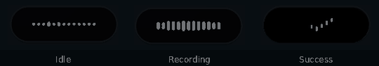

# Mic OSD styles

On layer-shell compositors, hyprwhspr can show one of three microphone visualizations:

- `waveform` — the existing full waveform UI and transcript preview (default)
- `vu_meter` — the existing VU meter
- `pill` — a compact monochrome status pill



Choose a style in `~/.config/hyprwhspr/config.json`:

```jsonc
{
  "$schema": "https://raw.githubusercontent.com/goodroot/hyprwhspr/main/share/config.schema.json",
  "mic_osd_style": "pill"
}
```

Restart the service after changing the style:

```bash
systemctl --user restart hyprwhspr
```

The pill intentionally omits transcript text. It shows idle dots in silence, responsive white bars while recording, a travelling wave while processing, a pulse on error, and a short checkmark animation on success.
